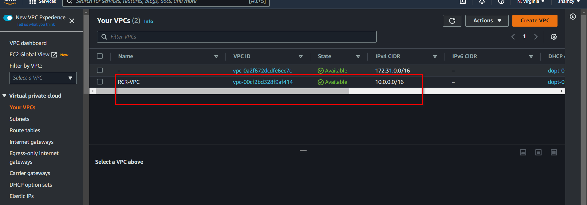
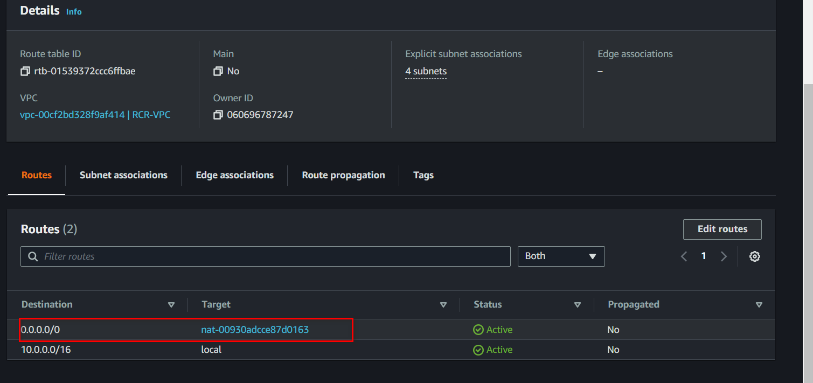
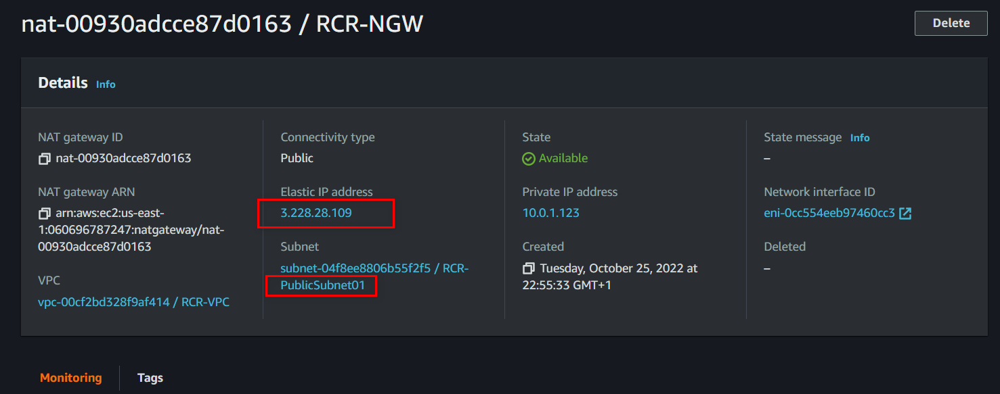
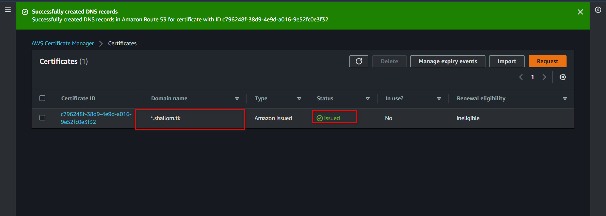

# AWS CLOUD SOLUTION FOR 2 COMPANY WEBSITES USING A REVERSE PROXY TECHNOLOGY
In this project, we will build a secure infrastructure inside AWS VPC (Virtual Private Cloud) network for a fictitious company (Choose an interesting name for it) that uses WordPress CMS for its main business website, and a Tooling Website (https://github.com/<your-name>/tooling) for their DevOps team. As part of the company’s desire for improved security and performance, a decision has been made to use a reverse proxy technology from NGINX to achieve this.

`Cost, Security, and Scalability are the major requirements for this project. Hence, implementing the architecture designed below, ensure that infrastructure for both websites, WordPress and Tooling, is resilient to Web Server’s failures, can accomodate to increased traffic and, at the same time, has reasonable cost.`

## Project Design Architecture Diagram
#

#

## Starting Off AWS Project

1. Properly configure your AWS account and Organization Unit [Watch How To Do This Here](https://youtu.be/9PQYCc_20-Q)
   
- Create an AWS Master account. (Also known as Root Account)
- Within the Root account, create a sub-account and name it DevOps. (You will need another email address to complete this)
- Within the Root account, create an AWS Organization Unit (OU). Name it Dev. (We will launch Dev resources in there)
Move the DevOps account into the Dev OU.
- Login to the newly created AWS account using the new email address.
- Create a free domain name for your fictitious company at Freenom domain registrar here.

- Create a hosted zone in AWS, and map it to your free domain from Freenom. [Watch how to do that here](https://youtu.be/IjcHp94Hq8A)

**NOTE** : As you proceed with configuration, ensure that all resources are appropriately tagged, for example:

- Project: <Give your project a name>
- Environment: <dev>
- Automated: <No> (If you create a recource using an automation tool, it would be <Yes>)
#

## Setting Up Infrastucture

1. Create a VPC

2. Create subnets as shown in the architecture

3. Create a route table and associate it with public subnets

4. Create a route table and associate it with private subnets
   

5. Create an Internet Gateway

6. Edit a route in public route table, and associate it with the Internet Gateway. (This is what allows a public subnet to be accisble from the Internet)
   

7. Create an Elastic IP

8. Create a Nat Gateway and assign one of the Elastic IPs (*The other 2 will be used by Bastion hosts)
   

9. Create a Security Group for:

- Nginx Servers: Access to Nginx should only be allowed from a Application Load balancer (ALB). At this point, we have not created a load balancer, therefore we will update the rules later. For now, just create it and put some dummy records as a place holder.
  
- Bastion Servers: Access to the Bastion servers should be allowed only from workstations that need to SSH into the bastion servers. Hence, you can use your workstation public IP address. To get this information, simply go to your terminal and type curl www.canhazip.com
  
- Application Load Balancer: ALB will be available from the Internet
Webservers: Access to Webservers should only be allowed from the Nginx servers. Since we do not have the servers created yet, just put some dummy records as a place holder, we will update it later.

- Data Layer: Access to the Data layer, which is comprised of Amazon Relational Database Service (RDS) and Amazon Elastic File System (EFS) must be carefully desinged – only webservers should be able to connect to RDS, while Nginx and Webservers will have access to EFS Mountpoint.

#

## Proceed With Compute Resources
#

You will need to set up and configure compute resources inside your VPC. The recources related to compute are:

- EC2 Instances
- Launch Templates
- Target Groups
- Autoscaling Groups
- TLS Certificates
- Application Load Balancers (ALB)
  
### TLS Certificates From Amazon Certificate Manager (ACM)
#

You will need TLS certificates to handle secured connectivity to your Application Load Balancers (ALB).

- Navigate to AWS ACM
- Request a public wildcard certificate for the domain name you registered in Freenom
- Use DNS to validate the domain name
- Tag the resource
- Bind the ACM to the route53 hosted zone created earlier

#

### Setup EFS
#
Amazon Elastic File System (Amazon EFS) provides a simple, scalable, fully managed elastic Network File System (NFS) for use with AWS Cloud services and on-premises resources. In this project, we will utulize EFS service and mount filesystems on both Nginx and Webservers to store data.

- Create an EFS filesystem
- Create an EFS mount target per AZ in the VPC, associate it with both subnets dedicated for data layer
- Associate the Security groups created earlier for data layer.
Create an EFS access point. (Give it a name and leave all other settings as default)

