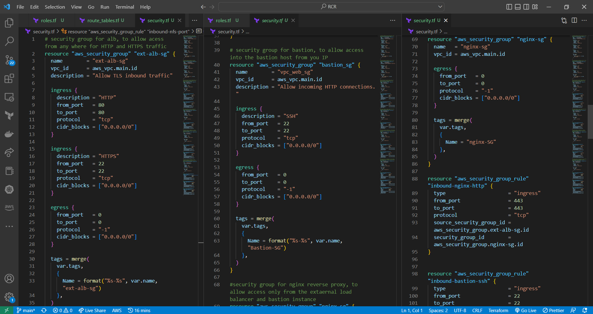
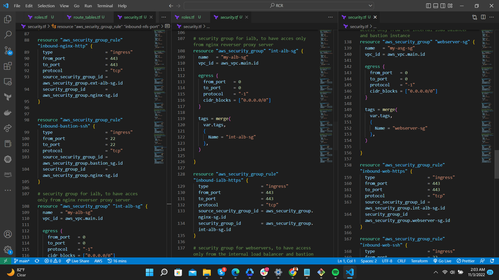
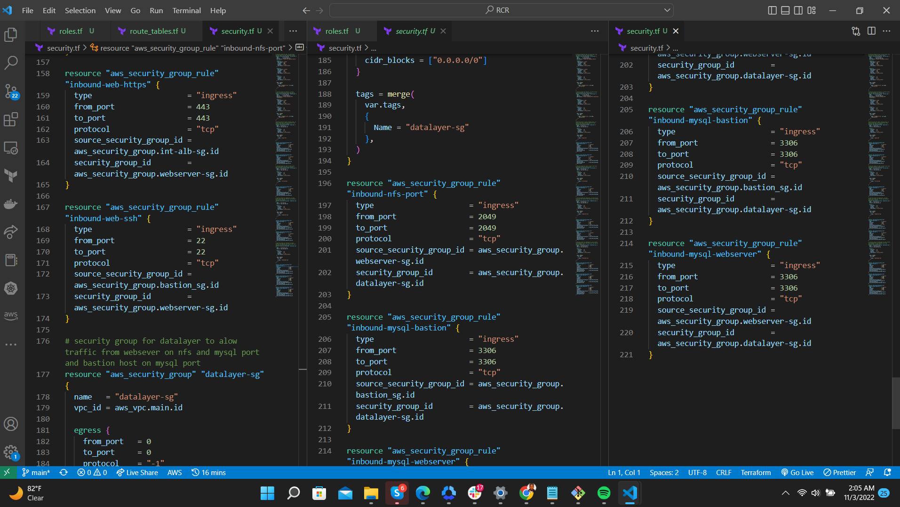
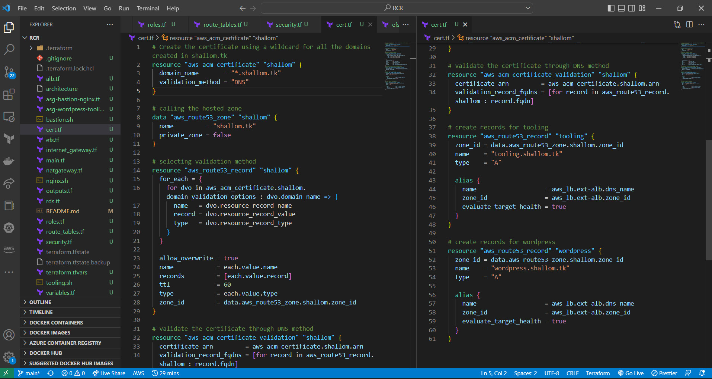
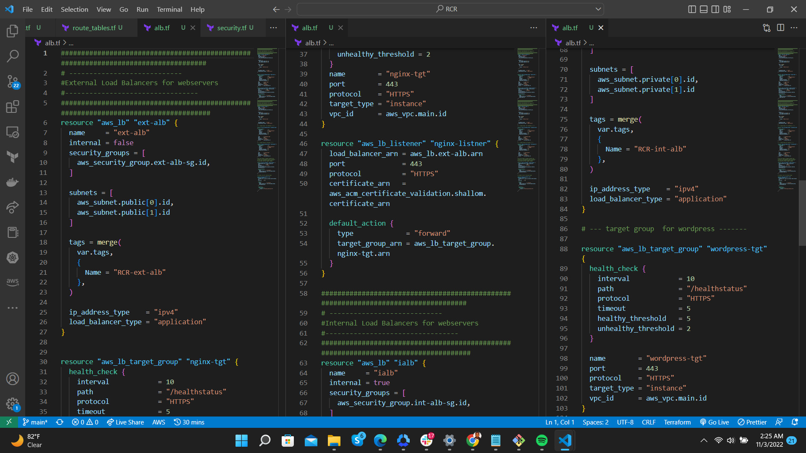
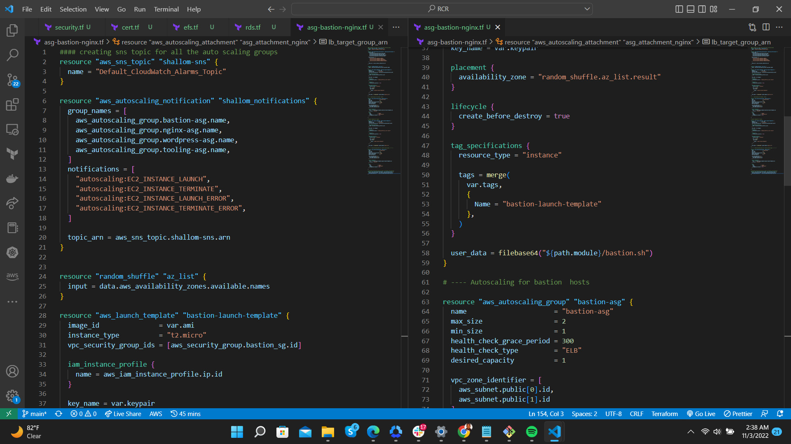
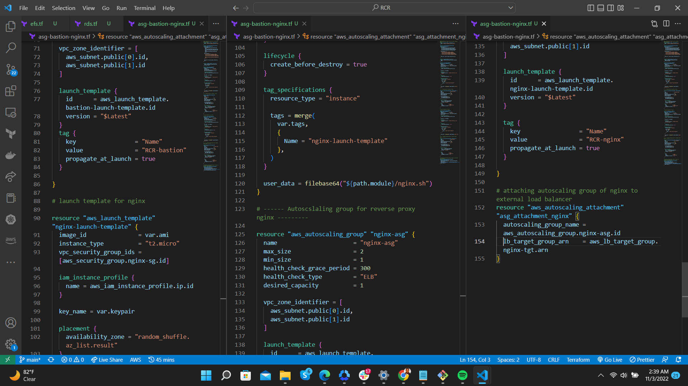
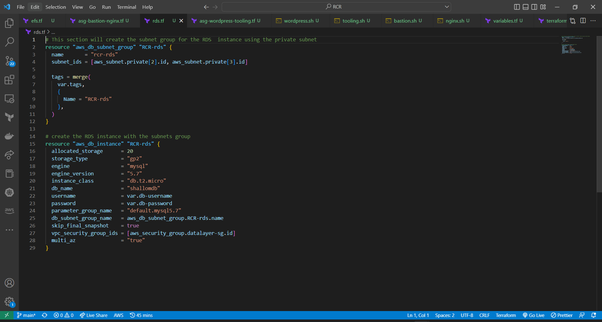

## FURTHER IMPLEMENTATION OF INFRASTRUCTURE AUTOMATION WITH IAC USING TERRAFORM
#

## Understading Basic Network Concepts
#
### IP Address: 
- An IP address is a unique address that identifies a device on the internet or a local network. IP stands for "Internet Protocol," which is the set of rules governing the format of data sent via the internet or local network.

### Subnets
- A subnet, or subnetwork, is a segmented piece of a larger network. More specifically, subnets are a logical partition of an IP network into multiple, smaller network segments. 

### CIDR Notation
- CIDR notation (Classless Inter-Domain Routing) is an alternate method of representing a subnet mask. It is simply a count of the
number of network bits (bits that are set to 1) in the subnet mask.

### IP Routing
- IP routing is the process of sending packets from a host on one network to another host on a different remote network

### Internet Gateways
- An internet gateway is a horizontally scaled, redundant, and highly available VPC component that allows communication between your VPC and the internet
  
### NAT
- A NAT gateway is a Network Address Translation (NAT) service. You can use a NAT gateway so that instances in a private subnet can connect to services outside your VPC but external services cannot initiate a connection with those instances.
  

### Create 4 private subnets keeping in mind following principles:
- Make sure you use variables or length() function to determine the number of AZs
- Use variables and cidrsubnet() function to allocate vpc_cidr for subnets
- Keep variables and resources in separate files for better code structure and readability
- Tags all the resources you have created so far. Explore how to use format() and count functions to automatically tag subnets with its respective number.
  

### Internet Gateways & format() function
Create an Internet Gateway in a separate Terraform file internet_gateway.tf. This serves as an entry point for internet into the virtual private network

###NAT Gateways
- Create 1 NAT Gateways and 1 Elastic IP (EIP) addresses

- Now use similar approach to create the NAT Gateways in a new file called natgateway.tf.

Note: We need to create an Elastic IP for the NAT Gateway, and you can see the use of depends_on to indicate that the Internet Gateway resource must be available before this should be created. Although Terraform does a good job to manage dependencies, but in some cases, it is good to be explicit.

### AWS ROUTES
- Create a file called route_tables.tf and use it to create routes for both public and private subnets, create the below resources. Ensure they are properly tagged.

- aws_route_table
- aws_route
- aws_route_table_association

### AWS Identity and Access Management
### IaM and Roles
We want to pass an IAM role our EC2 instances to give them access to some specific resources, so we need to do the following:

Create AssumeRole
Assume Role uses Security Token Service (STS) API that returns a set of temporary security credentials that you can use to access AWS resources that you might not normally have access to. These temporary credentials consist of an access key ID, a secret access key, and a security token. Typically, you use AssumeRole within your account or for cross-account access.

Add the following code to a new file named `roles.tf`

#
###  Further Resources to be created
#
As per our architecture we need to do the following:

- Create Security Groups
- Create Target Group for Nginx, WordPress and Tooling
- Create certificate from AWS certificate manager
- Create an External Application Load Balancer and Internal Application Load Balancer.
- Create launch template for Bastion, Tooling, Nginx and WordPress
- Create an Auto Scaling Group (ASG) for Bastion, Tooling, Nginx and WordPress
- Create Elastic Filesystem
- Create Relational Database (RDS)

### CREATE SECURITY GROUPS
We are going to create all the security groups in a single file, then we are going to refrence this security group within each resources that needs it.

Create a file and name it `security.tf`, copy and paste the code below

### CREATE CERTIFICATE FROM AMAZON CERIFICATE MANAGER
Create `cert.tf file` and add the following code snippets to it.

### Create an external (Internet facing) Application Load Balancer (ALB)
Create a file called alb.tf

First of all we will create the ALB, then we create the target group and lastly we will create the lsitener rule.

ALB
ALB-target
ALB-listener
We need to create an ALB to balance the traffic between the Instances:

To inform our ALB to where route the traffic we need to create a Target Group to point to its targets

Then we will need to create a Listner for this target Group

Repeat same for Internal Facing Loadbalancer

### CREATING AUSTOALING GROUPS
This Section we will create the Auto Scaling Group (ASG)
Now we need to configure our ASG to be able to scale the EC2s out and in depending on the application traffic.

Before we start configuring an ASG, we need to create the launch template and the the AMI needed. For now we are going to use a random AMI from AWS, we will use Packerto create our ami later on.

Based on our Architetcture we need for Auto Scaling Groups for bastion, nginx, wordpress and tooling, so we will create two files; asg-bastion-nginx.tf will contain Launch Template and Austoscaling group for Bastion and Nginx, then asg-wordpress-tooling.tf will contain Launch Template and Austoscaling group for wordpress and tooling.

Useful Terraform Documentation, go through this documentation and understand the arguement needed for each resources:

SNS-topic
SNS-notification
Austoscaling
Launch-template

Create asg-bastion-nginx.tf and paste all the code snippet below;

### STORAGE AND DATABASE
Useful Terraform Documentation, go through this documentation and understand the arguement needed for each resources:

RDS
EFS
KMS
Create Elastic File System (EFS)
In order to create an EFS you need to create a KMS key.

AWS Key Management Service (KMS) makes it easy for you to create and manage cryptographic keys and control their use across a wide range of AWS services and in your applications.

Add the following code to efs.tf

## Create MySQL RDS
Let us create the RDS itself using this snippet of code in rds.tf file:
