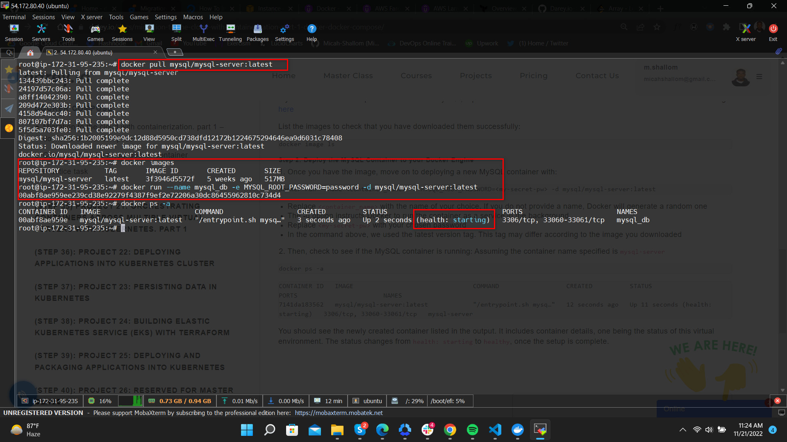
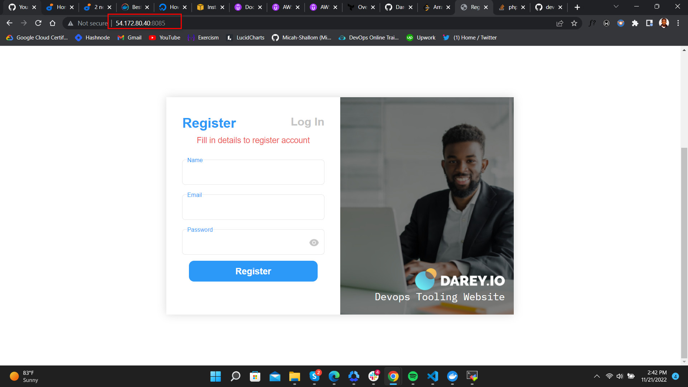
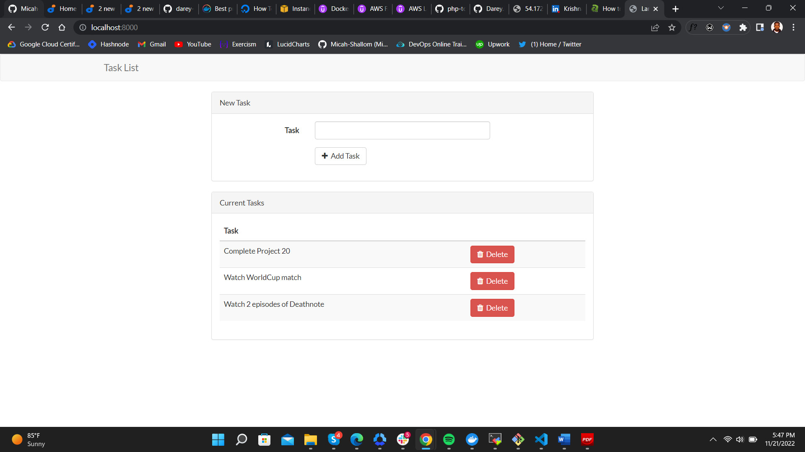
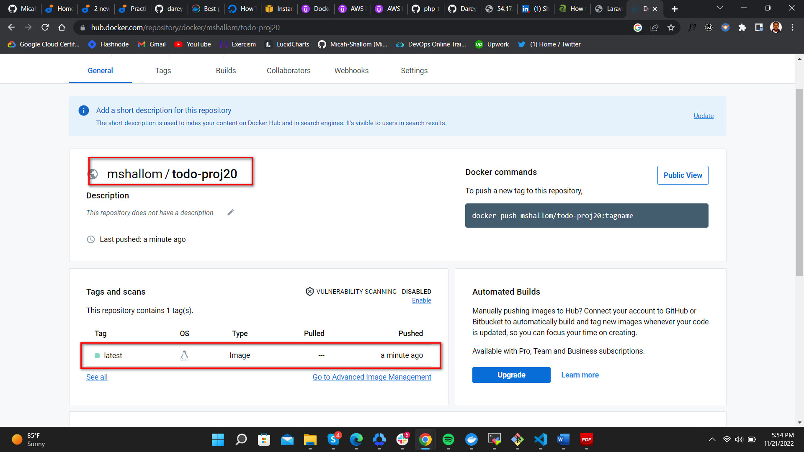
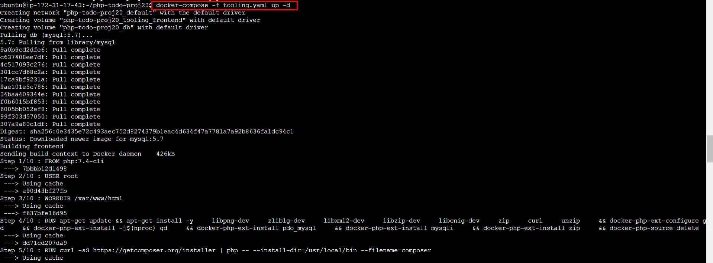

# MIGRATION TO THE СLOUD WITH CONTAINERIZATION

Until now, we have been using VMs (AWS EC2) in Amazon Virtual Private Cloud (AWS VPC) to deploy your web solutions, and it works well in many cases. 

We have learned how easy to spin up and configure a new EC2 manually or with such tools as Terraform and Ansible to automate provisioning and configuration.

 We have also deployed two different websites on the same VM; this approach is scalable, but to some extent; imagine what if you need to deploy many small applications (it can be web front-end, web-backend, processing jobs, monitoring, logging solutions, etc.) and some of the applications will require various OS and runtimes of different versions and conflicting dependencies – in such case you would need to spin up serves for each group of applications with the exact OS/runtime/dependencies requirements. When it scales out to tens/hundreds and even thousands of applications (e.g., when we talk of microservice architecture), this approach becomes very tedious and challenging to maintain.

In this project, we will learn how to solve this problem and practice the technology that revolutionized application distribution and deployment back in 2013! We are talking of Containers and imply Docker. Even though there are other application containerization technologies, Docker is the standard and the default choice for shipping your app in a container!

## Deploying Application Using Docker
#
### MySQL in container
### Step 1: Pull MySQL Docker Image from Docker Hub Registry

We pull the mysql image from the dockerhub repository(public) into our local server machine.

We run a container from this image and setup the mysqldb environment variables


`docker run --name <container_name> -e MYSQL_ROOT_PASSWORD=<my-secret-pw> -d mysql/mysql-server:latest`


#

## CONNECTING TO THE MYSQL DOCKER CONTAINER

We can either connect directly to the container running the MySQL server or use a second container as a MySQL client. Let us see what the first option looks like.

### Method 1

Connecting directly to the container running the MySQL server.
We can use the following commands to achieve this

```
$ docker exec -it mysql bash

or

$ docker exec -it mysql mysql -uroot -p
```
Provide the root password when prompted. With that, you’ve connected the MySQL client to the server.


### Method 2

At this stage you are now able to create a docker container but we will need to add a network. So, stop and remove the previous mysql docker container.

Run the MySQL Server container using a created network.

First, let us create an environment variable to store the root password:

$ export MYSQL_PW= 

Specify your password to be exported as environment variables

Verify the environment variable is created `echo $MYSQL_PW`

Then, pull the image and run the container, all in one command like below:

`docker run --network tooling_app_network -h mysqlserverhost --name=mysql-server -e MYSQL_ROOT_PASSWORD=$MYSQL_PW  -d mysql/mysql-server:latest`

This spins up a mysql client container and connects to the mysql-server via the mysqlserverhost connection


By executing into the client mysql container and run 

`mysql -uroot -h mysqlserverhost -p <password>`


As you already know, it is best practice not to connect to the MySQL server remotely using the root user. Therefore, we will create an SQL script that will create a user we can use to connect remotely.

Create a file and name it create_user.sql and add the below code in the file:

 $ CREATE USER 'mshallom'@'%' IDENTIFIED BY ''; 
 GRANT ALL PRIVILEGES ON * . * TO 'mshallom'@'%'; 

Run the script:
Ensure you are in the directory create_user.sql file is located or declare a path

`docker exec -i mysql-server mysql -uroot -p$MYSQL_PW < create_user.sql `

If you see a warning like below, it is acceptable to ignore:

`mysql: [Warning] Using a password on the command line interface can be insecure.`


## Prepare database schema
#

Now you need to prepare a database schema so that the Tooling application can connect to it.

Clone the Tooling-app repository from here

` $ git clone https://github.com/darey-devops/tooling.git `

On your terminal, export the location of the SQL file

`$ export tooling_db_schema=/tooling_db_schema.sql `

You can find the tooling_db_schema.sql in the tooling/html/tooling_db_schema.sql folder of cloned repo.

Verify that the path is exported

`echo $tooling_db_schema`

Use the SQL script to create the database and prepare the schema. With the docker exec command, you can execute a command in a running container.

`$ docker exec -i mysql-server mysql -uroot -p$MYSQL_PW < $tooling_db_schema `


Update the .env file with connection details to the database
The .env file is located in the html tooling/html/.env folder but not visible in terminal. you can use vi or nano

sudo vi .env

MYSQL_IP=mysqlserverhost
MYSQL_USER=username
MYSQL_PASS=client-secrete-password
MYSQL_DBNAME=toolingdb




## Containerizing our Tooling application

Make sure you have checked out your Tooling repo to your machine with Docker engine

First, we need to build the Docker image the tooling app will use. The Tooling repo you cloned above has a Dockerfile for this purpose. Explore it and make sure you understand the code inside it.
Run docker build command

Launch the container with docker run

Try to access your application via port exposed from a container



#

## PRACTICE TASK
## Practice Task №1 – Implement a POC to migrate the PHP-Todo app into a containerized application.

Download php-todo repository from here

The project below will challenge you a little bit, but the experience there is very valuable for future projects.

### Part 1
- Write a Dockerfile for the TODO app
- Run both database and app on your laptop Docker Engine
- Access the application from the browser

### Part 2
- Create an account in Docker Hub
- Create a new Docker Hub repository
- Push the docker images from your PC to the repository

### Part 3
- Write a Jenkinsfile that will simulate a Docker Build and a Docker Push to the registry
- Connect your repo to Jenkins
- Create a multi-branch pipeline
- Simulate a CI pipeline from a feature and master branch using previously created Jenkinsfile
- Ensure that the tagged images from your Jenkinsfile have a prefix that suggests which branch the image was pushed from. For example, feature-0.0.1.
- Verify that the images pushed from the CI can be found at the registry.

#

## Deployment with Docker Compose

In this section, we will refactor the Tooling app POC so that we can leverage the power of Docker Compose.

First, install Docker Compose on your workstation from here

Create a file, name it tooling.yaml

Begin to write the Docker Compose definitions with YAML syntax. The YAML file is used for defining services, networks, and volumes:

```
version: "3.9"
services:
  tooling_frontend:
    build: .
    ports:
      - "5000:80"
    volumes:
      - tooling_frontend:/var/www/html
    links:
      - db
  db:
    image: mysql:5.7
    restart: always
    environment:
      MYSQL_DATABASE: <The database name required by Tooling app>
      MYSQL_USER: <The user required by Tooling app>
      MYSQL_PASSWORD: <The password required by Tooling app>
      MYSQL_RANDOM_ROOT_PASSWORD: '1'
    volumes:
      - db:/var/lib/mysql
volumes:
  tooling_frontend:
  db:
```

Run the command to start the containers

`docker-compose -f tooling.yaml  up -d `



## Practice Task №2 – Complete Continous Integration With A Test Stage

 The Jenkinsfile has been updated with a smoke test phase that tests our application endpoint and returns a status 200
 
